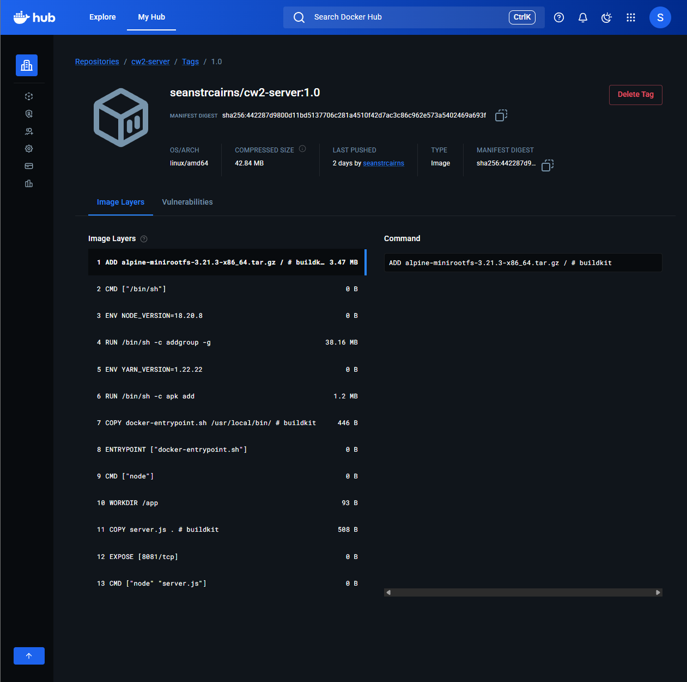
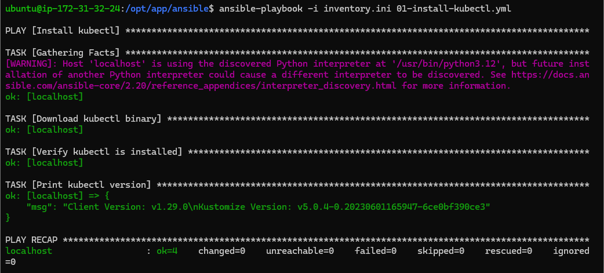
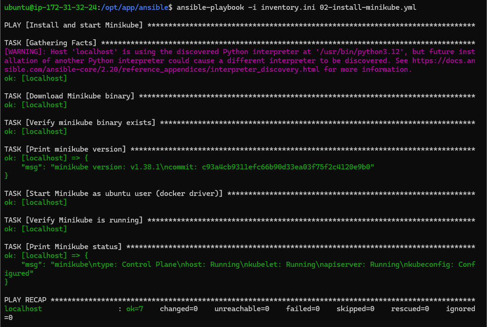
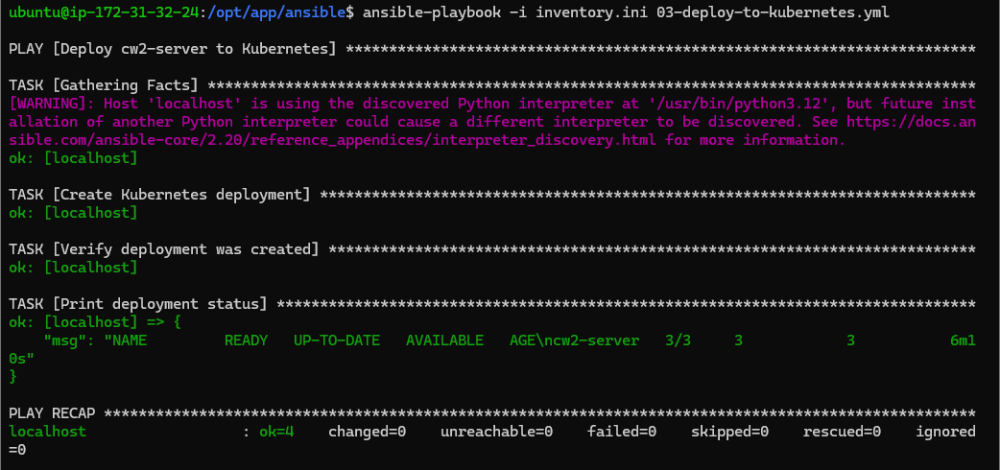
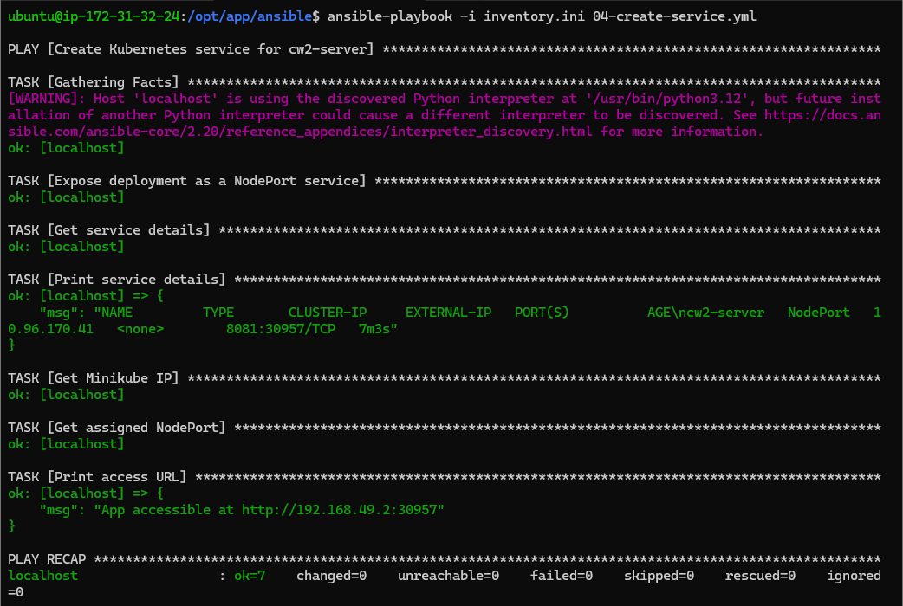
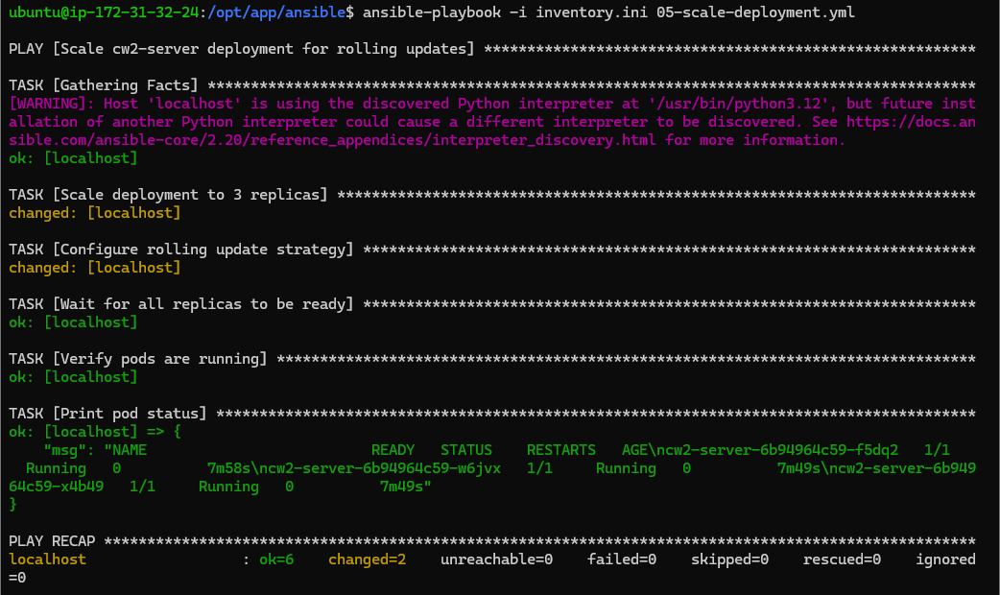

```{r setup, include=FALSE}
knitr::opts_chunk$set(
  echo      = FALSE,
  warning   = FALSE,
  message   = FALSE
)
```

\newpage

# Module Information

\begin{center}
\begin{tabular}{ll}
\toprule
\textbf{Module} & Software Engineering and DevOps (MMI330704) \\
\textbf{Coursework} & Coursework 2 --- Practical Evidence \\
\textbf{Group} & Group 4 \\
\textbf{Academic Year} & 2025--2026 \\
\textbf{Deadline} & Monday 20\textsuperscript{th} April 2026, 13:00 \\
\bottomrule
\end{tabular}
\end{center}

\vspace{1em}

This document constitutes the practical evidence submission for Coursework 2 of the Software Engineering and DevOps module. It presents evidence for all five required components as specified in the coursework brief: Docker evidence, Ansible terminal evidence, all Ansible playbooks, the completed Jenkinsfile, and the Jenkins console output for the final build.

The DevOps pipeline implemented follows the architecture described in the coursework specification, encompassing source control via GitHub, containerisation with Docker, infrastructure configuration via Ansible, a Kubernetes deployment managed through Minikube, and a continuous delivery pipeline orchestrated by Jenkins.

\newpage

# Docker Evidence

This section provides the `Dockerfile` written for the `cw2-server` Node.js application and screenshot evidence that the resulting image was successfully pushed to DockerHub.

## Dockerfile

The `Dockerfile` below containerises the `server.js` Node.js application. The `node:18-alpine` base image was selected for its minimal footprint, reducing image size and potential attack surface. The application directory is set to `/app`, the source file is copied in, port `8081` is exposed to match the application's listen port, and the server is started via the Node.js runtime.

``` dockerfile
FROM node:18-alpine

WORKDIR /app

COPY server.js .

EXPOSE 8081

CMD ["node", "server.js"]
```

The image was manually built and tagged as `cw2-server:1.0` using the following command on the Build Server, prior to being pushed to DockerHub:

``` bash
docker build -t seanstrcairns/cw2-server:1.0 .
docker push seanstrcairns/cw2-server:1.0
```

## DockerHub Screenshot

The screenshot below confirms that the `cw2-server` image with tag `1.0` was successfully pushed to DockerHub and is available for deployment.

```{r dockerhub, fig.cap="DockerHub repository showing cw2-server image with tag 1.0 successfully pushed.", out.width="100%", fig.pos="H"}

```

\newpage

# Ansible Evidence

This section provides terminal screenshot evidence confirming that all tasks within each of the five Ansible playbooks completed successfully on the Production Server. Playbooks were executed locally on the Production Server using `ansible_connection=local` as defined in `inventory.ini`.

## Playbook 01 — Install kubectl

The screenshot below shows the terminal output confirming that the `kubectl` binary was downloaded to `/usr/local/bin/kubectl`, permissions were set, and the installed version was verified successfully.

```{r playbook01, fig.cap="Terminal output: Playbook 01 — kubectl installed and version verified.", out.width="100%", fig.pos="H"}

```

## Playbook 02 — Install and Start Minikube

The screenshot below confirms that the Minikube binary was downloaded, Minikube was started using the Docker driver as the `ubuntu` user, and `minikube status` confirmed the cluster was running successfully.

```{r playbook02, fig.cap="Terminal output: Playbook 02 — Minikube installed and started with Docker driver.", out.width="100%", fig.pos="H"}

```

## Playbook 03 — Deploy to Kubernetes

The screenshot below confirms that the `cw2-server` Kubernetes deployment was created from the DockerHub image (`seanstrcairns/cw2-server:1.0`) and that `kubectl get deployment cw2-server` returned a successful status.

```{r playbook03, fig.cap="Terminal output: Playbook 03 — cw2-server deployment created in Kubernetes.", out.width="100%", fig.pos="H"}

```

## Playbook 04 — Create Kubernetes Service

The screenshot below confirms that a `NodePort` service was exposed for the `cw2-server` deployment on port `8081`, and the application access URL (Minikube IP and assigned NodePort) was printed successfully.

```{r playbook04, fig.cap="Terminal output: Playbook 04 — NodePort service created and access URL printed.", out.width="100%", fig.pos="H"}

```

## Playbook 05 — Scale Deployment for Rolling Updates

The screenshot below confirms that the deployment was scaled to 3 replicas, the rolling update strategy was patched with `maxUnavailable: 1` and `maxSurge: 1`, and `kubectl rollout status` confirmed all replicas were ready. Three replicas satisfies the rolling update criteria: with `maxUnavailable: 1`, at least two pods remain available to serve traffic throughout any update.

```{r playbook05, fig.cap="Terminal output: Playbook 05 — Deployment scaled to 3 replicas, rolling update strategy configured.", out.width="100%", fig.pos="H"}

```

\newpage

# All Ansible Playbooks

The complete source code for all five Ansible playbooks is provided below, along with the inventory file used to target the Production Server.

## Inventory File

``` ini
[prod]
localhost ansible_connection=local ansible_user=ubuntu
```

The inventory file defines a single host group (`prod`) targeting `localhost` with a local connection, as the playbooks were executed directly on the Production Server.

## Playbook 01 — Install kubectl

``` yaml
---
# Task 2a — Install kubectl
- name: Install kubectl
  hosts: prod
  become: true

  tasks:
    - name: Download kubectl binary
      get_url:
        url: "https://dl.k8s.io/release/v1.29.0/bin/linux/amd64/kubectl"
        dest: /usr/local/bin/kubectl
        mode: "0755"

    - name: Verify kubectl is installed
      command: kubectl version --client
      register: kubectl_version
      changed_when: false

    - name: Print kubectl version
      debug:
        msg: "{{ kubectl_version.stdout }}"
```

## Playbook 02 — Install and Start Minikube

``` yaml
---
# Task 2b — Install and start Minikube
- name: Install and start Minikube
  hosts: prod
  become: true

  tasks:
    - name: Download Minikube binary
      get_url:
        url: "https://storage.googleapis.com/minikube/releases/latest/minikube-linux-amd64"
        dest: /usr/local/bin/minikube
        mode: "0755"

    - name: Verify minikube binary exists
      command: minikube version
      register: minikube_version
      changed_when: false

    - name: Print minikube version
      debug:
        msg: "{{ minikube_version.stdout }}"

    - name: Start Minikube as ubuntu user (docker driver)
      become: true
      become_user: ubuntu
      command: minikube start --driver=docker
      args:
        creates: /home/ubuntu/.minikube/profiles/minikube/config.json

    - name: Verify Minikube is running
      become: true
      become_user: ubuntu
      command: minikube status
      register: minikube_status
      changed_when: false

    - name: Print Minikube status
      debug:
        msg: "{{ minikube_status.stdout }}"
```

## Playbook 03 — Deploy to Kubernetes

``` yaml
---
# Task 2c — Deploy image from DockerHub to Kubernetes
- name: Deploy cw2-server to Kubernetes
  hosts: prod
  become: true
  become_user: ubuntu

  vars:
    dockerhub_username: "seanstrcairns"
    image_tag: "1.0"

  tasks:
    - name: Create Kubernetes deployment
      command: >
        kubectl create deployment cw2-server
        --image={{ dockerhub_username }}/cw2-server:{{ image_tag }}
      register: deploy_result
      failed_when:
        - deploy_result.rc != 0
        - '"already exists" not in deploy_result.stderr'
      changed_when: '"created" in deploy_result.stdout'

    - name: Verify deployment was created
      command: kubectl get deployment cw2-server
      register: deployment_status
      changed_when: false

    - name: Print deployment status
      debug:
        msg: "{{ deployment_status.stdout }}"
```

## Playbook 04 — Create Kubernetes Service

``` yaml
---
# Task 2d — Create a NodePort service for the application
- name: Create Kubernetes service for cw2-server
  hosts: prod
  become: true
  become_user: ubuntu

  tasks:
    - name: Expose deployment as a NodePort service
      command: >
        kubectl expose deployment cw2-server
        --type=NodePort
        --port=8081
      register: service_result
      failed_when:
        - service_result.rc != 0
        - '"already exists" not in service_result.stderr'
      changed_when: '"exposed" in service_result.stdout'

    - name: Get service details
      command: kubectl get service cw2-server
      register: service_status
      changed_when: false

    - name: Print service details
      debug:
        msg: "{{ service_status.stdout }}"

    - name: Get Minikube IP
      command: minikube ip
      register: minikube_ip
      changed_when: false

    - name: Get assigned NodePort
      command: >
        kubectl get service cw2-server
        -o jsonpath='{.spec.ports[0].nodePort}'
      register: node_port
      changed_when: false

    - name: Print access URL
      debug:
        msg: "App accessible at http://{{ minikube_ip.stdout }}:{{ node_port.stdout }}"
```

## Playbook 05 — Scale Deployment for Rolling Updates

``` yaml
---
# Task 2e — Scale deployment to 3 replicas and configure rolling update strategy
# 3 replicas satisfies the rolling update requirement:
# maxUnavailable=1 means 2 pods always serving traffic during an update
- name: Scale cw2-server deployment for rolling updates
  hosts: prod
  become: true
  become_user: ubuntu

  tasks:
    - name: Scale deployment to 3 replicas
      command: kubectl scale deployment cw2-server --replicas=3
      register: scale_result
      changed_when: '"scaled" in scale_result.stdout'

    - name: Configure rolling update strategy
      command: >
        kubectl patch deployment cw2-server
        -p '{"spec":{"strategy":{"type":"RollingUpdate",
        "rollingUpdate":{"maxUnavailable":1,"maxSurge":1}}}}'
      register: patch_result
      changed_when: '"patched" in patch_result.stdout'

    - name: Wait for all replicas to be ready
      command: kubectl rollout status deployment/cw2-server
      register: rollout_status
      changed_when: false

    - name: Verify pods are running
      command: kubectl get pods
      register: pods_status
      changed_when: false

    - name: Print pod status
      debug:
        msg: "{{ pods_status.stdout }}"
```

\newpage

# Completed Jenkinsfile

The Jenkinsfile below defines the full five-stage continuous delivery pipeline. It is configured as a Jenkins Pipeline Project and is triggered automatically by changes pushed to the GitHub repository via a webhook. Each stage is described in turn below.

**Stage 1 — Checkout:** Pulls the latest commit from the configured GitHub repository using the `checkout scm` directive, ensuring the pipeline always operates on the current codebase.

**Stage 2 — Build Image:** Builds a Docker image from the `Dockerfile` in the repository root, tagging it with both the Jenkins `BUILD_NUMBER` (for traceability) and `latest`. DockerHub credentials are injected securely via a Jenkins credential binding.

**Stage 3 — Build Test:** Launches a test container from the newly built image, waits five seconds for the Node.js process to initialise, verifies the runtime is present using `node --version`, and performs an HTTP health check via `curl` against the container's internal IP on port `8081`. The test container is always cleaned up in the `post { always }` block regardless of pass or fail.

**Stage 4 — Push to DockerHub:** Authenticates with DockerHub using the stored credentials and pushes both the build-numbered and `latest` tags, making the image available for deployment.

**Stage 5 — Deploy to Kubernetes:** This stage runs on the `prod-node` Jenkins agent (the Production Server), allowing it to issue `kubectl` commands directly without SSH. It performs a rolling update via `kubectl set image` and waits for the rollout to complete cleanly using `kubectl rollout status`, ensuring zero-downtime deployment.

``` groovy
pipeline {
    agent any

    environment {
        DOCKERHUB_CREDENTIALS = credentials('dockerhub-creds')
        IMAGE_NAME            = "${DOCKERHUB_CREDENTIALS_USR}/cw2-server"
    }

    stages {
        stage('Checkout') {
            steps {
                checkout scm
            }
        }

        stage('Build Image') {
            steps {
                sh "docker build -t ${IMAGE_NAME}:${BUILD_NUMBER} ."
                sh "docker tag ${IMAGE_NAME}:${BUILD_NUMBER} ${IMAGE_NAME}:latest"
            }
        }

        stage('Build Test') {
            steps {
                sh """
                    docker run -d --name test-${BUILD_NUMBER} \
                        -p 8082:8081 ${IMAGE_NAME}:${BUILD_NUMBER}
                    sleep 5
                    docker exec test-${BUILD_NUMBER} node --version
                    CONTAINER_IP=\$(docker inspect \
                        -f '{{range.NetworkSettings.Networks}}{{.IPAddress}}{{end}}' \
                        test-${BUILD_NUMBER})
                    curl -f http://\$CONTAINER_IP:8081 || exit 1
                """
            }
            post {
                always {
                    sh """
                        docker stop test-${BUILD_NUMBER} || true
                        docker rm   test-${BUILD_NUMBER} || true
                    """
                }
            }
        }

        stage('Push to DockerHub') {
            steps {
                sh "echo ${DOCKERHUB_CREDENTIALS_PSW} | \
                    docker login -u ${DOCKERHUB_CREDENTIALS_USR} --password-stdin"
                sh "docker push ${IMAGE_NAME}:${BUILD_NUMBER}"
                sh "docker push ${IMAGE_NAME}:latest"
            }
        }

        stage('Deploy to Kubernetes') {
            agent { label 'prod-node' }
            steps {
                sh """
                    /usr/local/bin/kubectl set image deployment/cw2-server \
                        cw2-server=${IMAGE_NAME}:${BUILD_NUMBER}
                    /usr/local/bin/kubectl rollout status deployment/cw2-server
                """
            }
        }
    }

    post {
        always {
            sh "docker logout || true"
        }
        success {
            echo "Pipeline succeeded — build ${BUILD_NUMBER} deployed to Kubernetes."
        }
        failure {
            echo "Pipeline failed at build ${BUILD_NUMBER}."
        }
    }
}
```

\newpage

# Jenkins Console Output

The full Jenkins console output for the final successful build is provided below. When reviewing the output, note the following key events:

- **Docker image creation** — evident in the `Build Image` stage where `docker build` reports each layer being processed and the image being tagged.
- **Docker image push to DockerHub** — evident in the `Push to DockerHub` stage where each layer digest is confirmed as pushed.
- **Kubernetes update command** — evident in the `Deploy to Kubernetes` stage where `kubectl set image` is issued and `kubectl rollout status` confirms the rolling update completed successfully.

```
Started by user admin
Obtained Jenkinsfile from git https://github.com/Cairnstew/SE_DevOps_Group_4_Coursework_2.git
[Pipeline] Start of Pipeline
[Pipeline] node
Running on Jenkins in /var/jenkins_home/workspace/SE_DevOps_Group_4_CW2
[Pipeline] {
[Pipeline] stage
[Pipeline] { (Declarative: Checkout SCM)
[Pipeline] checkout
Selected Git installation does not exist. Using Default
The recommended git tool is: NONE
using credential cw2-repo-token
Cloning the remote Git repository
Cloning repository https://github.com/Cairnstew/SE_DevOps_Group_4_Coursework_2.git
 > git init /var/jenkins_home/workspace/SE_DevOps_Group_4_CW2 # timeout=10
Fetching upstream changes from https://github.com/Cairnstew/SE_DevOps_Group_4_Coursework_2.git
 > git --version # timeout=10
 > git --version # 'git version 2.47.3'
using GIT_ASKPASS to set credentials GitHub repo credentials
 > git fetch --tags --force --progress -- https://github.com/Cairnstew/SE_DevOps_Group_4_Coursework_2.git +refs/heads/*:refs/remotes/origin/* # timeout=10
 > git rev-parse refs/remotes/origin/master^{commit} # timeout=10
 > git config core.sparsecheckout # timeout=10
 > git checkout -f e18f3085e1909dbc93d86c80100f64b766edd325 # timeout=10
Commit message: "feat(terraform): Update prod_server init"
First time build. Skipping changelog.
[Pipeline] }
[Pipeline] // stage
[Pipeline] withEnv
[Pipeline] {
[Pipeline] withCredentials
Masking supported pattern matches of $DOCKERHUB_CREDENTIALS or $DOCKERHUB_CREDENTIALS_PSW
[Pipeline] {
[Pipeline] withEnv
[Pipeline] {
[Pipeline] stage
[Pipeline] { (Checkout)
[Pipeline] checkout
Selected Git installation does not exist. Using Default
The recommended git tool is: NONE
using credential cw2-repo-token
 > git rev-parse --resolve-git-dir /var/jenkins_home/workspace/SE_DevOps_Group_4_CW2/.git # timeout=10
Fetching changes from the remote Git repository
 > git config remote.origin.url https://github.com/Cairnstew/SE_DevOps_Group_4_Coursework_2.git # timeout=10
 > git fetch --tags --force --progress -- https://github.com/Cairnstew/SE_DevOps_Group_4_Coursework_2.git +refs/heads/*:refs/remotes/origin/* # timeout=10
 > git rev-parse refs/remotes/origin/master^{commit} # timeout=10
 > git config core.sparsecheckout # timeout=10
 > git checkout -f e18f3085e1909dbc93d86c80100f64b766edd325 # timeout=10
Commit message: "feat(terraform): Update prod_server init"
[Pipeline] }
[Pipeline] // stage
[Pipeline] stage
[Pipeline] { (Build Image)
[Pipeline] sh
+ docker build -t seanstrcairns/cw2-server:1 .
#0 building with "default" instance using docker driver
#1 [internal] load build definition from Dockerfile
#1 transferring dockerfile: 128B done
#1 DONE 0.0s
#2 [internal] load metadata for docker.io/library/node:18-alpine
#2 DONE 0.4s
#3 [internal] load .dockerignore
#3 transferring context: 2B done
#3 DONE 0.0s
#4 [internal] load build context
#4 transferring context: 744B done
#4 DONE 0.0s
#5 [1/3] FROM docker.io/library/node:18-alpine@sha256:8d6421d663b4c28fd3ebc498332f249011d118945588d0a35cb9bc4b8ca09d9e
#5 DONE 2.6s
#6 [2/3] WORKDIR /app
#6 DONE 0.3s
#7 [3/3] COPY server.js .
#7 DONE 0.0s
#8 exporting to image
#8 exporting layers 0.1s done
#8 exporting manifest sha256:e6386d480b03962b76ab92d72f0d77cbb75e7714bfc5367e396c1466ba4e0207 0.0s done
#8 exporting config sha256:2bb889639612f81013829b044be37dc4808d87211666f8c1fe7f2ac308b96711 0.0s done
#8 naming to docker.io/seanstrcairns/cw2-server:1 done
#8 DONE 0.3s
[Pipeline] sh
+ docker tag seanstrcairns/cw2-server:1 seanstrcairns/cw2-server:latest
[Pipeline] }
[Pipeline] // stage
[Pipeline] stage
[Pipeline] { (Build Test)
[Pipeline] sh
+ docker run -d --name test-1 -p 8082:8081 seanstrcairns/cw2-server:1
7c037818ec4c12f0aae4e41dac03adf28d9c267db8c1992e4ef45f6bfc1e1160
+ sleep 5
+ docker exec test-1 node --version
v18.20.8
+ docker inspect -f {{range.NetworkSettings.Networks}}{{.IPAddress}}{{end}} test-1
+ CONTAINER_IP=172.17.0.3
+ curl -f http://172.17.0.3:8081
100    54    0    54    0     0   6114      0 --:--:-- --:--:-- --:--:--  6750
DevOps Coursework 2! | Running on: 7c037818ec4c | v=0
Post stage
[Pipeline] sh
+ docker stop test-1
test-1
+ docker rm test-1
test-1
[Pipeline] }
[Pipeline] // stage
[Pipeline] stage
[Pipeline] { (Push to DockerHub)
[Pipeline] sh
+ echo ****
+ docker login -u seanstrcairns --password-stdin
Login Succeeded
[Pipeline] sh
+ docker push seanstrcairns/cw2-server:1
The push refers to repository [docker.io/seanstrcairns/cw2-server]
087c97b5ad67: Pushed
752efecf1de3: Pushed
6a55c6285ab5: Pushed
1: digest: sha256:5834215cebf8b5a0439d084ab455735c9e56e2983e38cf723c550eac6eff4624 size: 856
[Pipeline] sh
+ docker push seanstrcairns/cw2-server:latest
The push refers to repository [docker.io/seanstrcairns/cw2-server]
latest: digest: sha256:5834215cebf8b5a0439d084ab455735c9e56e2983e38cf723c550eac6eff4624 size: 856
[Pipeline] }
[Pipeline] // stage
[Pipeline] stage
[Pipeline] { (Deploy to Kubernetes)
[Pipeline] node
Running on prod-node in /home/ubuntu/jenkins/workspace/SE_DevOps_Group_4_CW2
[Pipeline] {
[Pipeline] sh
+ /usr/local/bin/kubectl set image deployment/cw2-server cw2-server=seanstrcairns/cw2-server:1
deployment.apps/cw2-server image updated
+ /usr/local/bin/kubectl rollout status deployment/cw2-server
Waiting for deployment "cw2-server" rollout to finish: 1 out of 3 new replicas have been updated...
Waiting for deployment "cw2-server" rollout to finish: 2 out of 3 new replicas have been updated...
Waiting for deployment "cw2-server" rollout to finish: 2 out of 3 new replicas have been updated...
Waiting for deployment "cw2-server" rollout to finish: 2 out of 3 new replicas have been updated...
Waiting for deployment "cw2-server" rollout to finish: 1 old replicas are pending termination...
Waiting for deployment "cw2-server" rollout to finish: 2 of 3 updated replicas are available...
deployment "cw2-server" successfully rolled out
[Pipeline] }
[Pipeline] // withEnv
[Pipeline] }
[Pipeline] // node
[Pipeline] }
[Pipeline] // stage
[Pipeline] stage
[Pipeline] { (Declarative: Post Actions)
[Pipeline] sh
+ docker logout
Removing login credentials for https://index.docker.io/v1/
[Pipeline] echo
Pipeline succeeded — build 1 deployed to Kubernetes.
[Pipeline] }
[Pipeline] // stage
[Pipeline] }
[Pipeline] // withEnv
[Pipeline] }
[Pipeline] // withCredentials
[Pipeline] }
[Pipeline] // withEnv
[Pipeline] }
[Pipeline] // node
[Pipeline] End of Pipeline
Finished: SUCCESS
```
